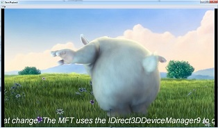

# MediaFoundationTransform

##  Common

Some helper files used by differents projects.

## MFTAsynchronous

### MFTAsynchronousAudio

* MFTAsynchronousAudio show minimal implementation for an asynchronous audio transform.
* This MFT works with media session pipeline, and tranform wave PCM audio data to wave FLOAT audio data.
* Does not show dynamic format change code handling (see MFTDirectxAware).
* Check shutdown status, even if documentation says :
> The client must not use the MFT after calling Shutdown.
* Does not handle Unlocking (MF_TRANSFORM_ASYNC_UNLOCK). This MFT doesn't care about applications who do not use this data processing model.
* This MFT just handles one input sample, and one output sample. There is no real sense to do this for an asynchronous MFT, it is just to show the minimal implementation (i will do it later).
* For now, just one audio file format can be use : 2 channels, 16 bits per sample, 48000 Hz (values are hardcoded).
* Markers : this MFT does not place markers after output sample. This MFT should do it.

### MFTAsynchronousVideo

In progress.

## MFTDirectxAware

### MFTSimpleDirectxAware

* This MFT uses IMFVideoSampleAllocator to provide D3D samples.
* MFTSimpleDirectxAware shows implementation for a D3D aware video transform.
* This MFT is MF_SA_D3D_AWARE, and handles stream format change (MFT_SUPPORT_DYNAMIC_FORMAT_CHANGE).
* Only the MFVideoFormat_NV12 is handled (evr requests only dxva2 compatible surfaces).
* Shows minimal use of IDirect3DDeviceManager9. It does not handle DXVA2_E_NEW_VIDEO_DEVICE on IDirect3DDeviceManager9::TestDevice.

### MFTVideoShaderEffect

* This MFT shows how to use IDirect3DDeviceManager9 to query IDirect3DDevice9 (IDirect3DDeviceManager9::LockDevice).
* This MFT shows how to use Directx shader (ID3DXEffect) and text (ID3DXFont) with IDirect3DDevice9.
* Also, shows how to provide uv coordinates in shader, to handle YUV video format correctly with tex2D.
* Using ID3DXFont to display text on an YUV format is not very correct in relation to color. It is just for the concept. The text is scrolling.
* MFTSimpleDirectxAware shows implementation for a D3D aware video transform.
* This MFT is MF_SA_D3D_AWARE, and handles stream format change (MFT_SUPPORT_DYNAMIC_FORMAT_CHANGE).
* Only the MFVideoFormat_NV12 is handled (evr requests only dxva2 compatible surfaces).
* Shows minimal use of IDirect3DDeviceManager9. It does not handle DXVA2_E_NEW_VIDEO_DEVICE on IDirect3DDeviceManager9::TestDevice.

## MFTPlayer

In progress.
